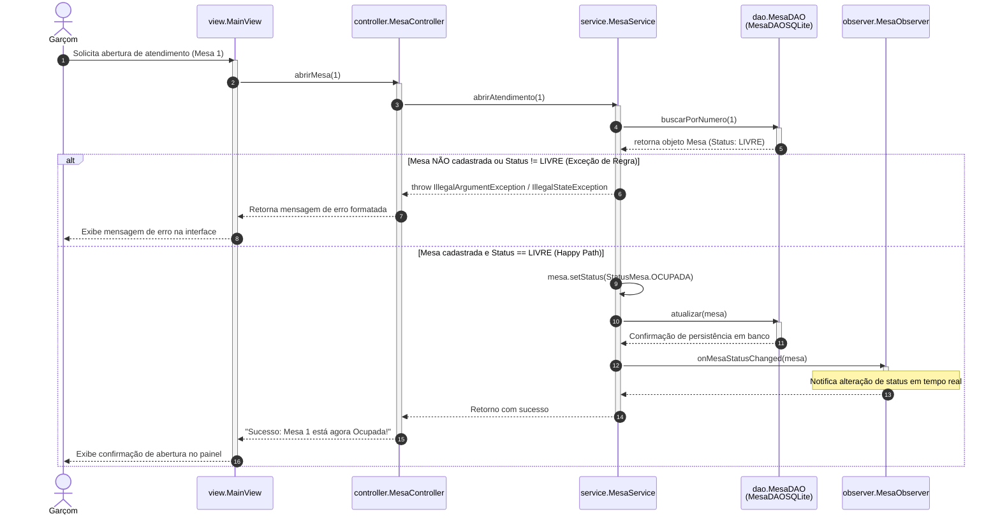
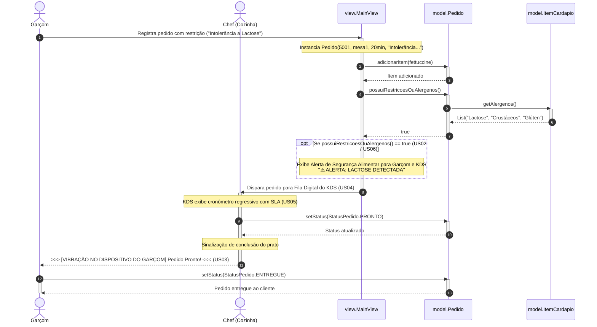
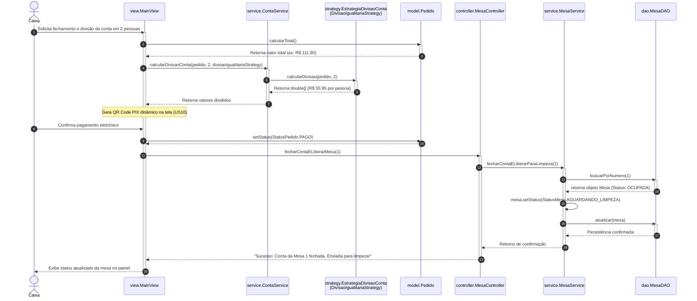
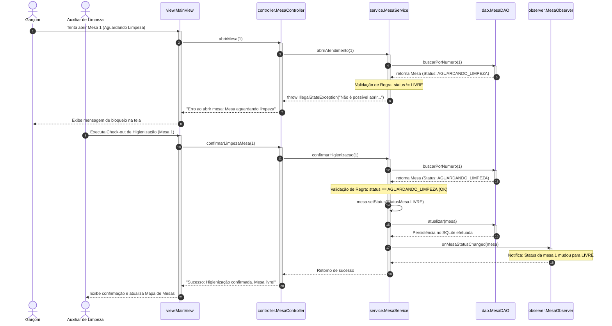

# Diagramas de Sequência UML - Santini Gourmet
## Documentação de Engenharia de Software e Modelagem de Objetos

**Curso:** Bacharelado em Sistemas de Informação  
**Instituição:** Universidade Federal da Paraíba (UFPB) - Campus IV  
**Disciplina:** Programação Orientada a Objetos (POO)  
**Projeto:** Sistema de Gestão Operacional Santini Gourmet  

---

## 1. Visão Geral e Mapeamento Arquitetural

Esta documentação apresenta os **Diagramas de Sequência UML** do sistema **Santini Gourmet**, detalhando a dinâmica comportamental do software, as mensagens trocadas entre objetos em tempo de execução e a estrita correspondência com a arquitetura em camadas e os requisitos (Casos de Uso / Histórias de Usuário).

### Tabela de Correspondência: Casos de Uso vs. Classes vs. Diagramas

| Caso de Uso / História de Usuário | Diagrama de Sequência Correspondente | Classes e Interfaces Envolvidas na Implementação Java |
| :--- | :--- | :--- |
| **US01** - Consulta de Cardápio Digital **US07** - Mapa de Mesas em Tempo Real | **Diagrama 1:** Abertura de Atendimento e Painel de Mesas | `MainView`, `MesaController`, `MesaService`, `MesaDAO`, `MesaDAOSQLite`, `StatusMesa`, `MesaObserver` |
| **US02** - Alertas Visuais de Alérgenos **US03** - Notificação de Prato Pronto **US04** - Fila Digital (KDS) **US05** - SLA de Preparo **US06** - Destaque de Restrições | **Diagrama 2:** Registro de Pedido, Alérgenos e Notificação da Cozinha | `MainView`, `Pedido`, `ItemCardapio`, `StatusPedido` |
| **US09** - Divisão Avançada de Contas (Split) **US10** - Pagamento via QR Code Pix | **Diagrama 3:** Fechamento de Conta e Divisão Inteligente (Strategy) | `MainView`, `ContaService`, `EstrategiaDivisaoConta`, `DivisaoIgualitariaStrategy`, `MesaController`, `MesaService` |
| **US08** - Check-out de Higienização Obrigatório | **Diagrama 4:** Trava de Segurança e Higienização de Mesa | `MainView`, `MesaController`, `MesaService`, `MesaDAO`, `MesaDAOSQLite`, `StatusMesa` |

---

## 2. Legenda e Convenções UML Utilizadas

Para garantir o **uso adequado dos elementos UML** e a **organização visual**, foram aplicadas as seguintes convenções padronizadas nos diagramas em sintaxe Mermaid:

*   **Atores (`actor`):** Entidades externas que iniciam fluxos de uso (`Garçom`, `Chef / Cozinha`, `Caixa`, `Equipe de Limpeza`).
*   **Participantes (`participant`):** Instâncias das classes das camadas `View`, `Controller`, `Service`, `DAO`, `Model` e `Strategy`.
*   **Linha de Vida (Lifeline):** Representação vertical da existência do objeto ao longo do tempo.
*   **Barra de Ativação (`activate` / `deactivate`):** Indica o período exato em que o objeto está executando um método ou processando informações na memória.
*   **Mensagem Síncrona (`->>`):** Chamada de método em que o emissor bloqueia aguardando a resposta.
*   **Mensagem de Retorno (`-->>`):** Linha tracejada indicando o retorno de dados ou término de execução de um método.
*   **Blocos Estruturados de Controle (`alt / else`, `opt`):**
    *   `alt / else`: Representa desvios condicionais e fluxos alternativos/de erro (ex: tentativa de abrir mesa ocupada vs. livre).
    *   `opt`: Fluxo opcional acionado por condições de regra de negócio (ex: alerta de alérgenos).

---

## 3. Diagramas de Sequência do Sistema

### Diagrama 1: Abertura de Atendimento e Consulta de Mesas (US01, US07)
**Descrição do Fluxo:** O Garçom inicia o atendimento de uma mesa. A solicitação trafega da `MainView` para o `MesaController` e atinge a regra de negócio no `MesaService`. O serviço consulta o banco de dados através da interface `MesaDAO` (implementada por `MesaDAOSQLite`). Caso a mesa esteja livre, seu estado é atualizado para `OCUPADA`, a alteração é persistida no SQLite e uma notificação é enviada aos objetos `MesaObserver`.

---

### Diagrama 2: Registro de Pedido, Alérgenos e Notificação da Cozinha (US02, US03, US04, US05, US06)
**Descrição do Fluxo:** O Garçom vincula itens do cardápio ao pedido. O modelo `Pedido` valida se os alérgenos descritos nos itens (`ItemCardapio`) entram em conflito com a restrição declarada pelo cliente. O pedido é enviado à fila da Cozinha (KDS), que monitora o SLA de tempo de preparo. Ao concluir, o Chef atualiza o pedido para `PRONTO`, disparando um alerta tátil (vibração) no terminal do Garçom.

---

### Diagrama 3: Fechamento de Conta, Divisão (Strategy) e QR Code Pix (US09, US10)
**Descrição do Fluxo:** Ao solicitar a conta, o Caixa invoca o `ContaService` utilizando a estratégia `DivisaoIgualitariaStrategy` (Padrão Strategy). Calculada a divisão por pessoa, a `MainView` simula a emissão do QR Code Pix. Após a baixa do pagamento, o `MesaController` fecha a conta e atualiza o estado da mesa no banco SQLite para `AGUARDANDO_LIMPEZA`.

---

### Diagrama 4: Trava Operacional e Check-out de Higienização (US08)
**Descrição do Fluxo:** Demonstra a regra de negócio estrita do **Check-out de Higienização Obrigatório**. Se um garçom tentar acomodar novos clientes em uma mesa no estado `AGUARDANDO_LIMPEZA`, a camada `MesaService` bloqueia a ação lançando uma exceção. A mesa só retorna ao status `LIVRE` após o envio da confirmação pela Equipe de Limpeza.

---

## 4. Avaliação dos Critérios de Qualidade da Modelagem UML

1.  **Representação Correta das Interações entre Objetos:**
    *   Todos os métodos invocados nos diagramas (ex: `abrirAtendimento()`, `fecharContaELiberarParaLimpeza()`, `confirmarHigienizacao()`, `calcularDivisaoConta()`) existem exatamente com o mesmo nome e parâmetros nas classes Java correspondentes.
2.  **Clareza dos Fluxos de Execução:**
    *   A numeração automática (`autonumber`) permite acompanhar a ordem exata de execução vertical das mensagens de cima para baixo.
3.  **Correspondência entre Diagramas, Casos de Uso e Implementação:**
    *   Cada uma das 10 Histórias de Usuário do documento técnico foi devidamente mapeada e representada em um diagrama específico.
4.  **Uso Adequado dos Elementos UML:**
    *   Emprego rigoroso das raias de ativação (`activate`/`deactivate`), tratamento de retornos tracejados (`-->>`), anotações de estado (`Note over`) e estruturas de controle (`alt/else` para exceções e `opt` para alertas).
5.  **Organização Visual e Legibilidade:**
    *   Separação clara em 4 diagramas temáticos em sintaxe Mermaid nativa com renderização fluida no repositório.
